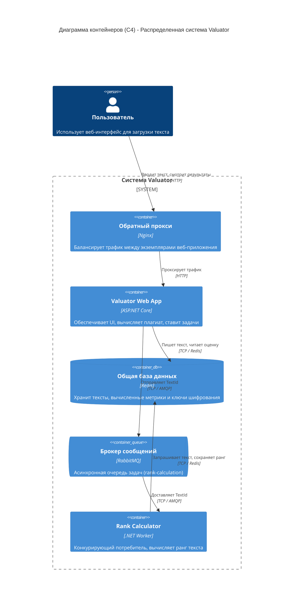

Для бубнты надо поставить dotnet

```bash
sudo apt install -y dotnet-sdk-10.0
dotnet add package Microsoft.AspNetCore.DataProtection.StackExchangeRedis
```

Запустить и опустить:

```bash
./bin/valuator_up
./bin/valuator_down
```

Для тестирования:

```bash
for i in $(seq 1 10); do curl http://localhost:8080/instance; echo; done
```


